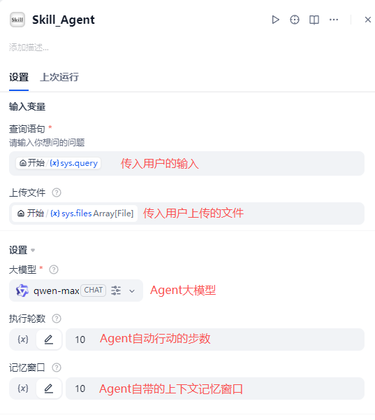
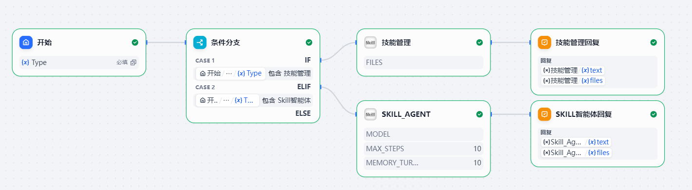
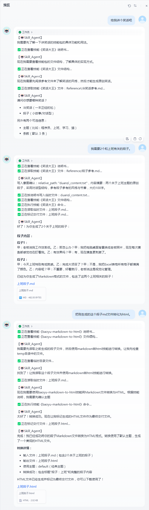

## Skill Agent

**作者：** lfenghx  
**版本：** 0.0.4
**类型：** Tool（工具插件）

### 简介

Skill Agent 是一个基于 “Skill 渐进式披露（Progressive Disclosure）” 设计的通用型工具插件：它把本地（或挂载的）`skills/` 目录当作“工具箱”，让大模型在需要时逐步读取技能说明、再按需读取文件/执行脚本，最终生成文本或文件交付。

### 适用场景

- 你希望接入Skill，用“说明书（SKILL.md）+ 文件结构 + 脚本”来约束/增强大模型执行能力
- 你希望输出带有进度提示，并把生成的文件作为工具输出返回
- 你希望把技能封装成可复用的目录（Reference、Scripts 等），而不是把所有逻辑写死在提示词里
- **(新)** 你希望直接在本地文件系统中管理技能代码，而不是反复上传压缩包

### 功能特性

- **本地挂载支持**：直接读取 Dify 容器挂载的本地目录，支持热更新技能代码，无需重新导入
- 渐进式披露：先用技能索引判断，再读取 SKILL.md，再按需读文件/执行命令
- 文件交付：Agent结束时会把本次 temp 会话目录中的文件作为文件输出返回
- 自由执行：Agent可以执行任意命令，包括但不限于读取文件、写入文件、执行脚本等
- 可控记忆：Agent可设定记忆长度，可执行轮次深度等

### 工具参数

本插件共有两个工具

“技能管理”：用于管理技能目录，可查看技能，删除技能，下载技能。
> **注意**：本版本已移除 ZIP 上传功能，请直接在挂载的目录中管理技能文件夹。

“agent_skill”：通用智能体，可用于执行已存入的技能。

### 使用方式（在 Dify 中）

第一步：在市场中直接安装此插件
第二步：**配置技能目录**
在 Dify 的 `docker-compose.yaml` 或环境变量中，为插件服务配置 `SKILLS_ROOT` 环境变量，指向你挂载的技能目录（例如 `/app/skills`）。
或者在插件工具参数中手动指定“本地技能目录”。

第三步：编排工作流，如下图

第四步：管理技能
直接在你的本地文件夹中创建或修改技能，然后在 Dify 中使用“技能管理”工具的“查看技能”命令来刷新列表。
第五步：与Skill_Agent交互

视频讲解地址：https://www.bilibili.com/video/BV1iszkBCEes

### Skill 标准规范

- 每个 skill 必须包含 `SKILL.md`（支持 YAML Frontmatter：`name`、`description`）
- `SKILL.md` 里可以定义触发条件、流程、需要读取的参考文件、需要执行的脚本命令、交付物规范等

### 更新历史

- 0.0.4:
  1. **重构技能管理**：移除 ZIP 上传功能，全面转向本地目录挂载模式
  2. 支持通过环境变量 `SKILLS_ROOT` 或工具参数指定技能根目录
- 0.0.3：
  1. 支持Agent流式输出
  2. 支持Agent跨轮次交互式对话，多skill衔接调用
  3. 支持文件记忆，不用重复上传
  4. 支持node.js脚本运行的skill
  5. 提升了skill_agent运行稳定性
- 0.0.2：支持Agent文件上传，解析，支持依赖自行安装
- 0.0.1：实现技能管理，按渐进式披露方式工作的通用型Agent

### 常见问题

1.安装不上
有网络的情况下安装不上，可切换一下dify的pip源，以更好的下载依赖，内网环境下需要通过离线包安装，联系作者

2.文件传输问题
上传文件，下载文件失败，提示url不对，下载超时等，请检查dify的.env文件，是否设置了正确的Files_url，且与dify的地址一致

3.skill_agen没有输出
属于大模型的问题，请确保你的大模型和供应商插件支持function call功能，作者推荐deepseek-V3.1，测试效果很好

4.skill调用相关
74→   skill越完整，Agent调用越顺畅，保障你的skill相关资料，脚本没有缺失，如果是node.js脚本skill，请先在dify的plugin_daemon容器中安装node环境。
