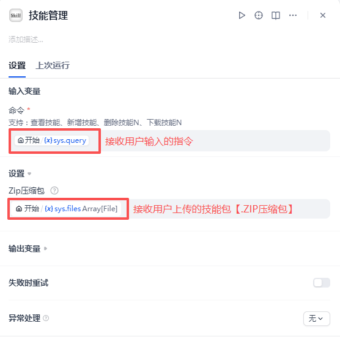

## Skill Agent

**Author:** lfenghx  
**Version:** 0.0.2  
**Type:** Tool (Plugin)

### Introduction

Skill Agent is a general-purpose tool plugin based on “Skill Progressive Disclosure”. It treats the local `skills/` directory as a toolbox, so the model can read the skill manual on demand, then read files / run scripts only when necessary, and finally deliver text or files.

### Use Cases

- You want to integrate Skills and constrain/strengthen the model using “manual (SKILL.md) + file structure + scripts”
- You want progress messages and to return generated files as tool outputs
- You want to package capabilities as reusable skill folders (Reference, Scripts, etc.) instead of hard-coding everything in prompts

### Features

- Progressive disclosure: skill index → read `SKILL.md` → read files / run commands as needed
- File delivery: all files in the temp session directory are returned when the agent finishes
- Free execution: the agent can execute commands such as reading/writing files and running scripts
- Controllable memory: configurable memory turns and max step depth

### Tool Parameters

This plugin provides two tools:

- “Skill Manager”: manages the local skills directory (list/add/delete skills)
  
- “agent_skill”: a general agent that can execute skills that have been stored
  

### How to Use (in Dify)

Step 1: Install this plugin directly from the Marketplace  
Step 2: For self-hosted deployments, set `Files_url` in Dify’s `.env` to your Dify address, otherwise Dify cannot fetch uploaded files  
Step 3: Build your workflow as shown below  
  
Step 4: Manage skills  
  
Step 5: Chat with Skill Agent  

Video tutorial: https://www.bilibili.com/video/BV1iszkBCEes

### Skill Standard

- Every skill must include `SKILL.md` (YAML frontmatter supported: `name`, `description`)
- `SKILL.md` can define trigger conditions, workflow, required reference reads, commands to run, and deliverable specs

### Changelog

- 0.0.2: Support agent file upload and parsing; support automatic dependency installation
- 0.0.1: Implement skill management and a general agent that works with progressive disclosure

### Author & Contact

- GitHub: lfenghx (repo: <https://github.com/lfenghx/skill_agent>)
- Bilibili: 元视界\_O凌枫o
- Email: 550916599@qq.com
